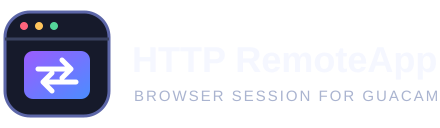

# Guacamole HTTP RemoteApp

A small xRDP container that opens HTTP/HTTPS applications in Firefox kiosk mode, so users can reach web interfaces through an Apache Guacamole RDP connection.

This is an independent community project, not an official Apache Guacamole component.



## How it works

```text
Apache Guacamole / guacd ── RDP ──> RemoteApp container ── HTTP/HTTPS ──> web application
                                     xRDP + Firefox kiosk
```

Each RDP session gets a temporary Firefox profile. The browser opens the URL supplied to the session, or `DEFAULT_URL` when no URL is supplied. This initial build intentionally does not include credential autofill or automatic acceptance of invalid TLS certificates.

## Status

The repository includes the container source and instructions for configuring it with Apache Guacamole. Review the [security notes](docs/SECURITY.md) and validate the setup in a test environment before using it with sensitive systems.

## Build and run

Requirements: Docker Engine with the Compose plugin.

1. Copy `.env.example` to `.env` and set a strong, unique `RDP_MASTER_PASSWORD`.
2. Build and start:

   ```sh
   docker compose up --build -d
   ```

3. A local RDP client can connect to `127.0.0.1:3389`. For Guacamole, place `guacd` and this service on the same Docker network and use the service name `remoteapp` as the RDP host.

The example binds RDP to loopback. Do not expose port 3389 to an untrusted network.

## Configuration

| Variable | Purpose | Default |
| --- | --- | --- |
| `RDP_MASTER_PASSWORD` | Shared password required by xRDP | Required |
| `RDP_BIND_ADDRESS` | Host interface for the local RDP port | `127.0.0.1` |
| `RDP_PORT` | Host RDP port | `3389` |
| `DEFAULT_URL` | Fallback URL | `about:blank` |

See [configuration](docs/CONFIGURATION.md) and [security notes](docs/SECURITY.md).

## Image distribution

The workflow builds the image on GitHub Actions without publishing it. Docker Hub is a good target for a later public release; during development, keep the source and any registry package private.

## License

This project is proprietary and all rights are reserved by the author. No permission to use, modify, or redistribute the code is granted without prior written authorization. See [LICENSE](LICENSE).
