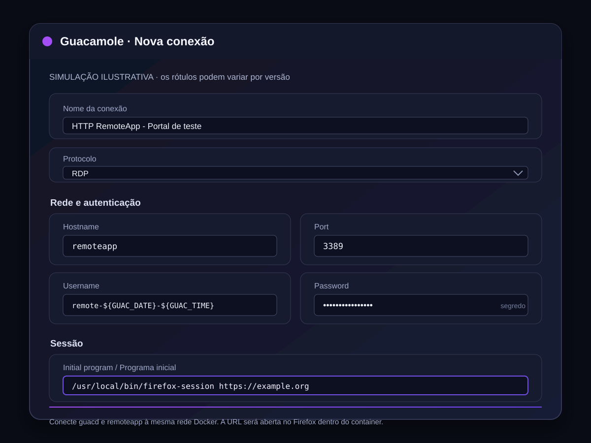

# Configuração

Esta seção mostra como criar uma conexão RDP no Guacamole para abrir um site dentro do container RemoteApp. Os nomes e a organização dos campos podem variar um pouco entre versões do Guacamole.

## 1. Preparar o container

1. Copie `.env.example` para `.env`.
2. Defina um valor forte e exclusivo para `RDP_MASTER_PASSWORD`.
3. Inicie o serviço:

   ```sh
   docker compose up --build -d
   ```

O Compose publica a porta RDP em `127.0.0.1:3389` por padrão. Se o `guacd` estiver em outro container, ambos precisam compartilhar uma rede Docker. Crie uma rede dedicada:

```sh
docker network create guac-net
```

Conecte o serviço `remoteapp` e o serviço `guacd` a essa rede nos respectivos arquivos Compose:

```yaml
services:
  remoteapp:
    networks:
      - guac-net

networks:
  guac-net:
    external: true
```

Adicione o mesmo bloco `networks` ao Compose do Guacamole/`guacd`. Nessa rede, o hostname do container pode ser `remoteapp`; não é necessário expor a porta RDP publicamente.

## 2. Criar a conexão no Guacamole

No painel do Guacamole, abra **Settings → Connections → New Connection**. Configure os campos abaixo:

| Seção | Campo | Valor |
| --- | --- | --- |
| Básico | Nome | Por exemplo, `HTTP RemoteApp - Portal de teste` |
| Básico | Protocolo | `RDP` |
| Rede | Hostname | `remoteapp` (ou o nome DNS do container na rede compartilhada) |
| Rede | Port | `3389` |
| Autenticação | Username | `remote-${GUAC_DATE}-${GUAC_TIME}` |
| Autenticação | Password | O mesmo valor definido em `RDP_MASTER_PASSWORD` |
| Segurança | Security mode | Deixe o padrão `Any`, salvo se seu xRDP exigir outro modo |
| Sessão | Initial program / Programa inicial | `/usr/local/bin/firefox-session https://example.org` |
| Tela | Color depth | `24` (opcional) |

O usuário RDP é criado para a sessão. O exemplo usa os tokens de data e hora do Guacamole para gerar nomes diferentes. O nome expandido precisa conter apenas letras, números, ponto, sublinhado ou hífen, e ter no máximo 32 caracteres; por isso, mantenha o nome do usuário Guacamole curto.

O campo **Initial program** executa o caminho e os argumentos informados quando a sessão RDP começa. Aqui ele inicia o script do container diretamente com a URL do site. Para apontar para outro destino, substitua `https://example.org` por uma URL HTTP ou HTTPS que o container consiga alcançar.

> A conexão usa apenas o login RDP. O navegador não preenche credenciais do site e não ignora erros de certificado HTTPS.

### Exemplo em `user-mapping.xml`

Se sua instalação usa autenticação por `user-mapping.xml`, o conteúdo equivalente é:

```xml
<connection name="HTTP RemoteApp - Portal de teste">
    <protocol>rdp</protocol>
    <param name="hostname">remoteapp</param>
    <param name="port">3389</param>
    <param name="username">remote-${GUAC_DATE}-${GUAC_TIME}</param>
    <param name="password">VALOR_DE_RDP_MASTER_PASSWORD</param>
    <param name="security">any</param>
    <param name="initial-program">/usr/local/bin/firefox-session https://example.org</param>
    <param name="color-depth">24</param>
</connection>
```

Substitua `VALOR_DE_RDP_MASTER_PASSWORD` pelo segredo configurado no container. Proteja esse arquivo e evite publicá-lo em repositórios ou capturas de tela.

## 3. Testar e solucionar problemas

1. Salve a conexão e abra-a no Guacamole.
2. Confirme que o Firefox abre `https://example.org`.
3. Depois, troque a URL de exemplo pelo site desejado.
4. Para sites internos, confirme que o container consegue resolver o nome DNS e alcançar a porta do destino.

Se o Guacamole não conectar, confirme que `guacd` e `remoteapp` estão na mesma rede e que a senha coincide com `RDP_MASTER_PASSWORD`. Se a sessão abrir mas o site não, teste se a URL é válida e acessível a partir da rede do container.

## Campos e imagem ilustrativa

A imagem abaixo é uma simulação da configuração, não uma captura real do Guacamole. O nome **Initial program** corresponde ao parâmetro RDP `initial-program`, que recebe o programa a executar ao conectar.



Referências: [parâmetros RDP no manual do Guacamole](https://guacamole.apache.org/doc/gug/configuring-guacamole.html) e [tokens dinâmicos de conexão](https://guacamole.apache.org/doc/gug/configuring-guacamole.html#parameter-tokens).

## Variáveis do container

| Nome | Obrigatória | Uso |
| --- | --- | --- |
| `RDP_MASTER_PASSWORD` | Sim | Senha usada pelo xRDP |
| `RDP_BIND_ADDRESS` | Não | Interface local publicada; padrão `127.0.0.1` |
| `RDP_PORT` | Não | Porta publicada no host; padrão `3389` |
| `DEFAULT_URL` | Não | URL de fallback quando o programa inicial não fornece uma; padrão `about:blank` |
